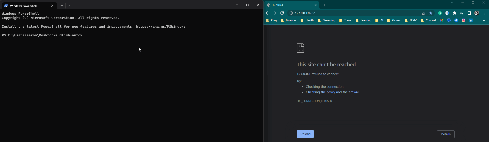

Auto Mudfish
================================

A rough script that automates logging in and connecting to Mudfish.

---

# How To Use

### Setup
Ensure requirements are installed

```bash
$ pip install -r requirements.txt
```

### Commandline

```bash
$ python automate_mudfish.py -u <mudfish-username> -p <mudfish-password>
```

### Auto Start

```python
from auto_mudfish import automate_mudfish

automate_mudfish.auto_start("username", "password")
```

### Module Use

```python
from auto_mudfish.process import MudfishProcess
from auto_mudfish.connection import MudfishConnection
from auto_mudfish.driver import get_chrome_driver

# mudfish launcher process
mudfish_process = MudfishProcess()

# start mudfish launcher
mudfish_process.start_mudfish_launcher()

# get a new instance of the chrome driver (defaults to headless)
chrome_driver = get_chrome_driver()

# create a mudfish connection instance
mudfish_connection = MudfishConnection(web_driver=chrome_driver)

# login with username and password
mudfish_connection.login("username", "password")

# # Connect/Disconnect
mudfish_connection.connect()
mudfish_connection.disconnect()

```
# Demo

###### *NOTE: I'm running a `bash` file so I don't expose my password. Feel free to set it up however you please.*


# Usage

It's suggested that you either use a rest API for a password manager, like Onepassword's [connect-sdk-python](https://youtu.be/0guOMTiwmhk](https://github.com/1Password/connect-sdk-python)), or to encrypt your password to disk.

```bash
usage: automate_mudfish.py [-h] -u USERNAME -p PASSWORD [-a ADMINPAGE] [-l LAUNCHER]

Auto-connect Mudfish

options:
  -h, --help            show this help message and exit
  -u USERNAME, --username USERNAME
                        Username to Mudfish account.
  -p PASSWORD, --password PASSWORD
                        Password to Mudfish account.
  -a ADMINPAGE, --adminpage ADMINPAGE
                        Optional admin page url. (Default is 'http://127.0.0.1:8282/signin.html')
  -l LAUNCHER, --launcher LAUNCHER
                        Optional Mudfish Launcher location override. (Default is `C:/Program Files (x86)/Mudfish Cloud VPN/mudrun.exe` for Desktop.)
```
